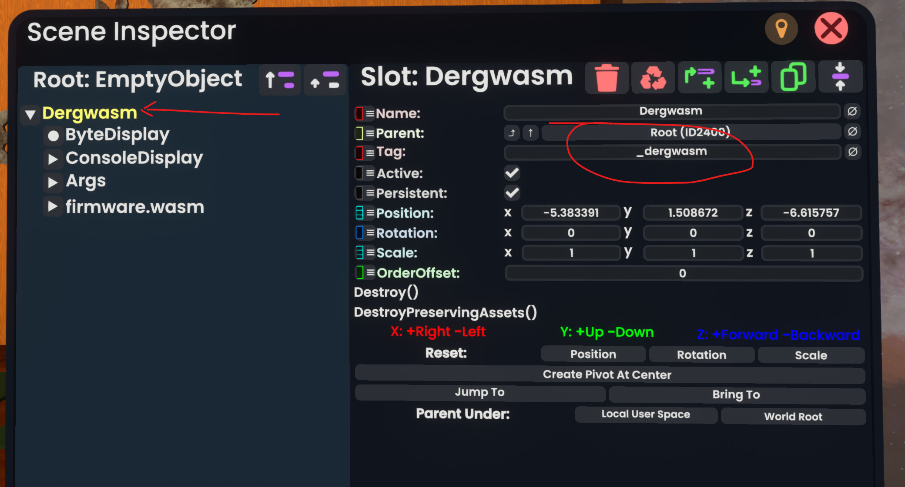
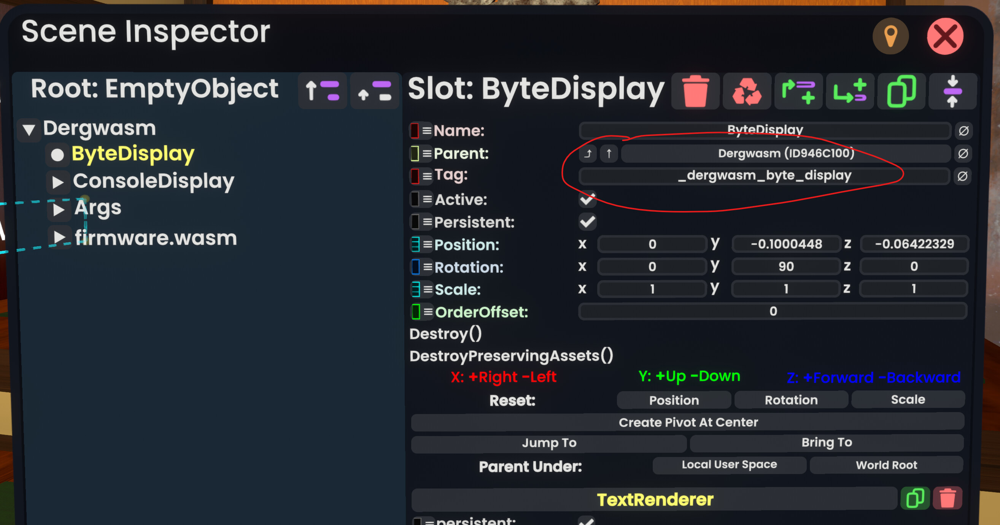
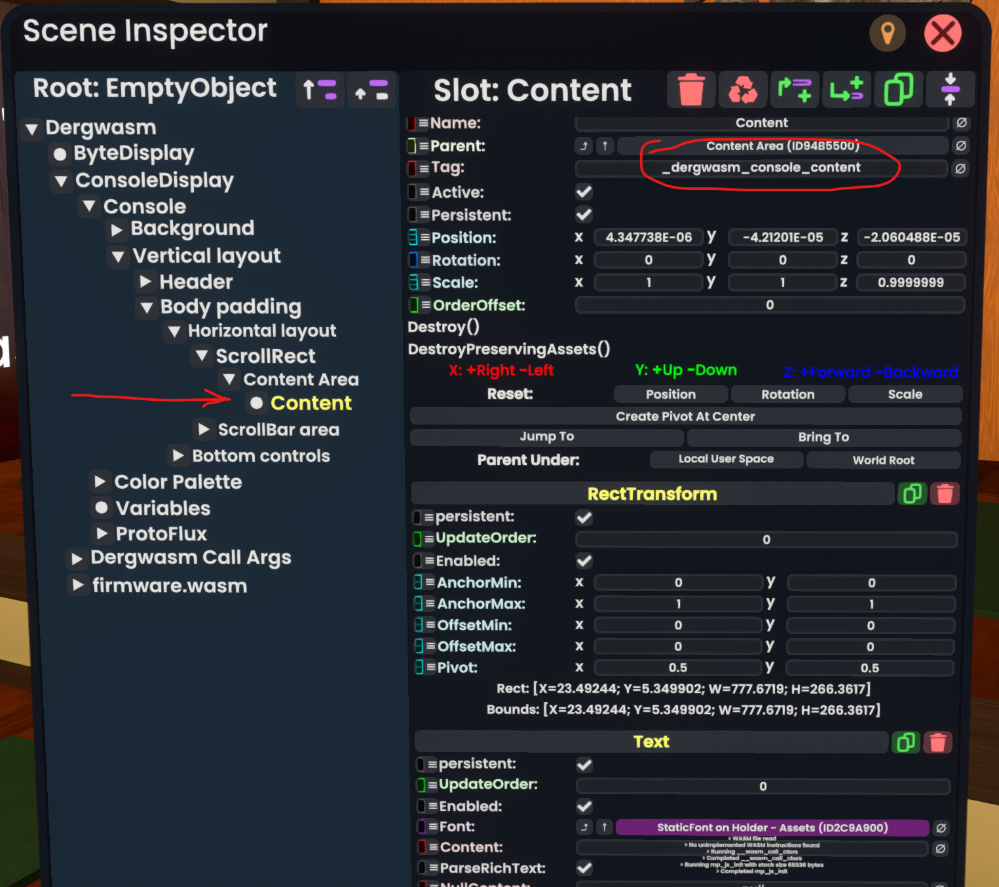
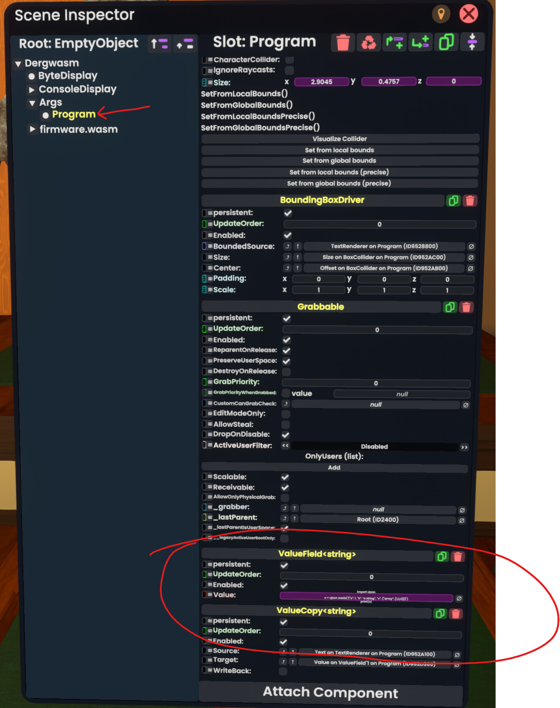
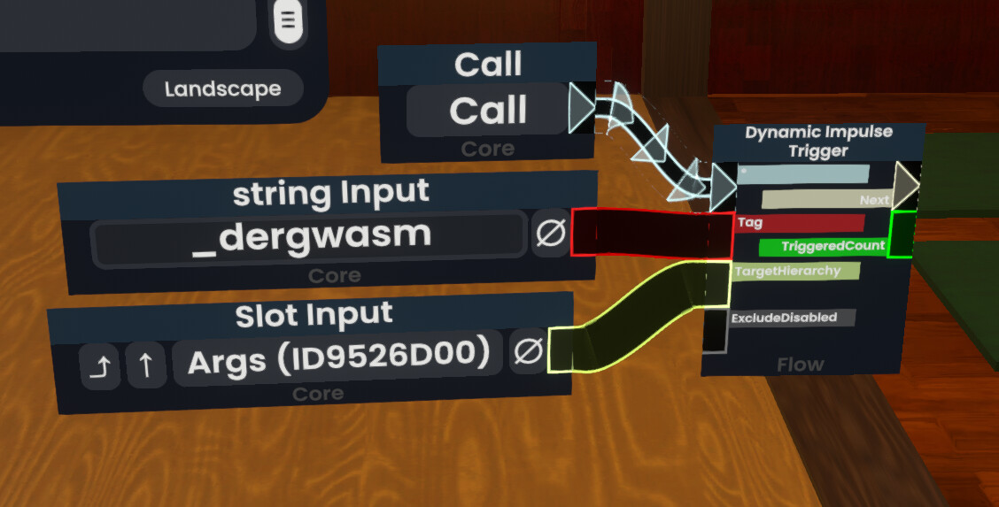

# Dergwasm

## Introduction

Dergwasm is a [WASM](https://en.wikipedia.org/wiki/WebAssembly) interpreter that runs as a mod in [Resonite](https://resonite.com/).

Several languages have support for compiling into WASM. Just to name a few:

* C/C++
* C#
* Ruby
* Rust
* Go
* Java
* and [more](https://www.fermyon.com/wasm-languages/webassembly-language-support)

Some of these languages don't actually compile into WASM, but rather provide a bytecode interpreter written in WASM. For example, Python.

> WARNING: Dergwasm is currently in alpha. This means that hardly any Resonite API methods have been implemented.

> NOTE: Dergwasm does not have access to your computer's filesystem, except for loading the WASM file you want to run.

## MicroPython

Dergwasm includes a WASM binary, `firmware.wasm`, which implements a [MicroPython](https://micropython.org/) interpreter. This means you can execute a subset of Python code in Resonite! MicroPython only supports syntax up to Python 3.4.

> NOTE: The MicroPython implementation does not have access to your computer's filesystem. Instead, it uses a slot as a virtual filesystem.

## Installation

> WARNING: Installation at this point isn't turnkey. You must be familiar with the Dev Tool, the inspector, and the ProtoFlux tool.

1. If you haven't already done so, install [Resonite Mod Loader](https://github.com/resonite-modding-group/ResoniteModLoader).
2. From the [latest release](https://github.com/RobertBaruch/dergwasm/releases), under Assets, download `Dergwasm.dll` and `firmware.wasm`.
3. Copy `Dergwasm.dll` into your `rml_mods` directory. See the [Resonite Mod Loader instructions](https://github.com/resonite-modding-group/ResoniteModLoader) for details about that.
4. Start Resonite.
5. To verify that the mod loaded, you can look in your Resonite logs for something like this line:

    ```txt
    6:38:54 PM.614 ( -1 FPS)	[INFO] [ResoniteModLoader/Dergwasm] Dergwasm patches applied
    ```

6. Copy this URL, and paste it into your world in Resonite: `resrec:///U-Xekri/R-a6ddab70-db2d-41cf-be0e-4f7a356afe69`. This is a Dergwasm slot hierarchy, already set up.
   
7. Re-initialize Dergwasm by using the ProtofluxTool to create a Dynamic Impulse Trigger node. Set its `Tag` to `_dergwasm_init` and its `TargetHierarchy` to the top-level Dergwasm slot. Now trigger the node. There will be a slight hitch as the WASM file is read in and parsed.

### The `Dergwasm` slot

1. The `firwmware.wasm` slot has a tag `_dergwasm_wasm_file`. It's just an imported WASM file. The name of the slot doesn't matter, since Dergwasm searches for it by tag. You can actually set this for any WASM file you have, but there must be only one under the Dergwasm hierarchy.
   

2. There is a `Text` object (`ByteDisplay`) with tag `_dergwasm_byte_display`. Currently this object is only intended to display your computer's file path where it loads `firmware.wasm` from.
    

3. The `Console` slot is a text display adapted slightly from the standard text display that Resonite spawns when you import a text file. This will display debug messages from Dergwasm, as well as any printed output from WASM. Buried within this hiearchy is a Content slot with tag `_dergwasm_console_content`, which is how Dergwasm finds the text for the console.
    

4. There's a slot under the `Dergwasm` slot called `Args`, with tag `_dergwasm_args`. It has a `ValueField<string>` component. This field contains the WASM function name you want to call.
    > If you're just interested in running MicroPython, the value in the field should be `mp_js_do_str`.
    

5. Under the `Args` slot, you can add as many slots as you want, one for each argument to the WASM function. Make sure the `OrderOffset` fields are set to order the slots according to the argument order. Each slot must have one `ValueField` component.
   > If you're just interested in running MicroPython, you only want one argument with a `ValueField<string>` component, containing your Python code. Here I used a `Text` object, and used a `ValueCopy` component to copy the text into the `ValueField<string>` component.
    

6. Create a `Dynamic Impulse Trigger` ProtoFlux node. Set its tag input to `_dergwasm` and its hierarchy input to your `Args` slot. Call it when you want to execute a WASM function.
    

## Technical notes

WASM code is normally assumed to be running in a browser, but in general, it relies on a "host environment". Thus, compiled WASM code normally also comes with a JavaScript file which is the host environment. However, Dergwasm implements a host environment in C#.

Any "external" functions required by the WASM code are implemented in the host environment, whether that be JavaScript, or, as in Dergwasm, C#. This includes a Resonite API.

A WASM file requires all of its external functions to be present. If an external function is not present, Dergwasm will output a message to the Resonite log and to `dergwasm_console_content`, and you will not be able to do anything else until Dergwasm provides an implementation of that external function.

## Compilation

If you want to compile the mod, I'm not sure I captured all the requirements. At a minimum:

1. Use Visual Studio 2022 to load and build the Dergwasm project that is in `dergwasm_mod/Dergwasm.sln`. This should give you `Dergwasm.dll`.

2. Use a Linux system, [install Emscripten](https://emscripten.org/docs/getting_started/downloads.html). I suggest using the `emsdk` tool.
3. On the Linux system, clone the [MicroPython repo](https://github.com/micropython/micropython).
4. Make a directory `user_modules/resonite` in the repo root.
5. Copy everything from `usercmodule/resonite` into that directory.
6. `cd ports/webassembly`
7. `make clean`
8. `make V=1 USER_C_MODULES=../../user_modules`
9. This should give you `build/firmware.wasm`.